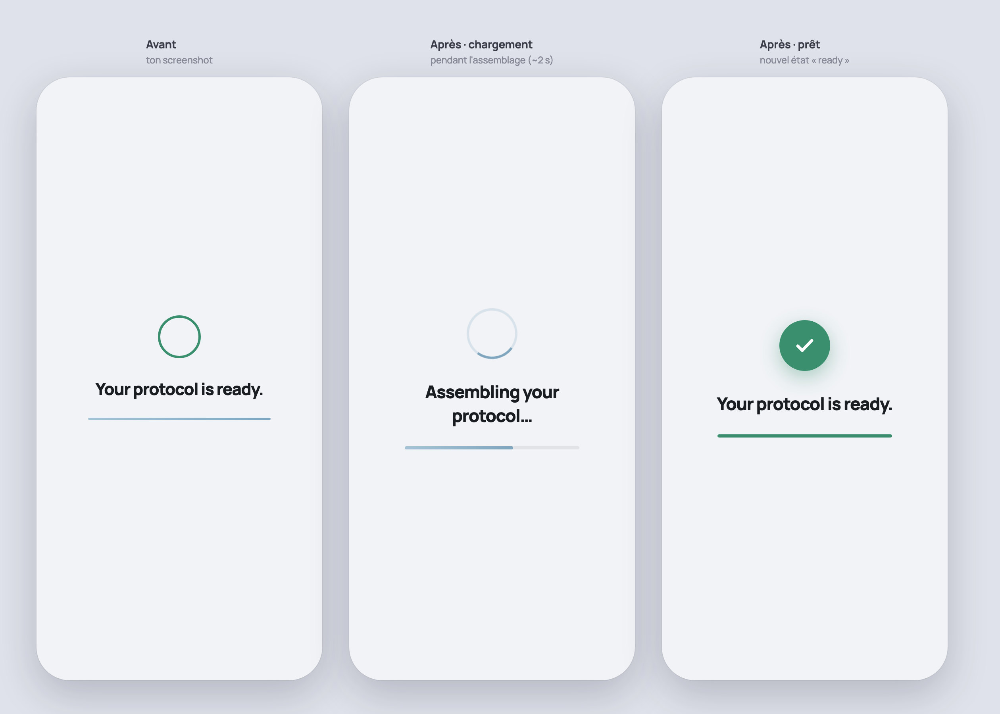

# Mise à jour UI — écran « Assembling / Your protocol is ready »

**Date :** 2026-06-30
**Écran concerné :** overlay de transition `#protoGen` (entre la routine du soir et l'écran Protocole).

## Voir le rendu
Ouvrir [`preview.html`](./preview.html) dans un navigateur (double-clic). Aperçu statique : [`apercu.png`](./apercu.png).

Les 3 colonnes : **Avant** (l'existant) · **Après · chargement** · **Après · prêt**.

## Pourquoi
L'overlay était le parent pauvre de ses voisins (`.intro`, `.phase`) :

1. **Il flottait.** `position:absolute; top:360px` figeait le bloc trop haut → grand vide en bas sur les écrans hauts.
2. **L'état « prêt » avait l'air cassé.** Un simple anneau vert vide, alors que l'autre indicateur de succès de l'app (`.intro-spin.done`) est une pastille verte pleine avec un check blanc.
3. **La barre fine restait bleue** (couleur de chargement) sous le mot « ready » — un résidu qui contredisait le message de succès.
4. Une chaîne **française résiduelle** (`"On assemble ton protocole…"`) sur un écran sinon 100 % anglais.

## Ce qui a changé

### `src/features/routine/storytelling.ts`
- Ajout d'un `<svg>` check à l'intérieur de l'anneau (`#genRing`) pour pouvoir le révéler à l'état « prêt ».
- Correction du titre français → `"Assembling your protocol…"`.
- La transition inline de la barre inclut désormais `background` → fondu vers le vert.

### `src/components/screens/routine-v2.css` (règles `.gen-*`)
- `.gen-stack` : vrai centrage vertical (`inset:0; justify-content:center`) au lieu de `top:360px` → plus de flottement, robuste sur toutes les hauteurs d'écran.
- `.gen-ring.done` : pastille verte pleine + check blanc + ombre douce + petit effet « pop » (`@keyframes genPop`), aligné sur `.intro-spin.done`.
- La barre passe au vert à l'état prêt (`.gen-ring.done ~ .gen-bar i`) et est légèrement plus épaisse (3 → 4 px).
- Anneau 54 → 64 px, titre 21 → 22 px (plus de présence).

## Note
La séquence réelle est animée : le spinner tourne, puis se mue en check avec le « pop », et la barre se remplit puis vire au vert. La capture statique ne montre que les états clés.
